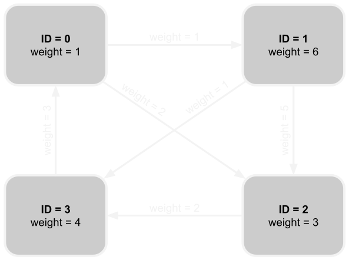

# EdgeLab

A high-performance C++20 graph library for efficient graph loading, generation, and analysis. Supports flexible templated graph types, multithreading, and OpenCL for parallelism.

---

## Features

- **Flexible Graph Types:** Directed/undirected graphs with weighted/unweighted vertices/edges
- **Custom Data Storage:** Extensible data storage for vertices and edges
- **Multiple Graph Generators:** Built-in generators for common graph types
- **Graph File Loading and Saving:** Support for multiple graph file formats
- **Efficient CSR Format:** Compressed Sparse Row (CSR) representation for memory efficiency
- **Multithreading:** Graph-specific thread-safe data structures with multithreaded example programs
- **OpenCL GPU Acceleration:** CSR interface for OpenCL with high-performance OpenCL example programs
- **Modern C++20:** Concepts, templates, and other modern C++ features
- **Type Safety:** Strong type system with compile-time guarantees
- **Command Line Interface (CLI):** CLI for graph configuration and dispatching of templated algorithms
- **Automated Testing (CI):** GitHub Actions for CI to ensure all EdgeLab features are working
- **Cross-Platform Build System:** Optional OpenCL support with graceful fallback

---

## Graph Representation

EdgeLab supports a comprehensive set of graph types through flexible templating. The library provides different vertex and edge types that can be combined to create various graph configurations.

### Basic Graph Structure

- EdgeLab Graphs are composed of Vertices and Edges
- Vertices are identified by unique 32-bit unsigned integers (densely packed)
- Edges connect vertices, having a source and destination vertex
- An edge connecting source vertex ID (u) to destination (v) is written as (u, v)
- We define a vertex's **degree** as the number of edges it is a source to

### Graph Storage Format

- EdgeLab graphs are stored in Condensed Sparse Row (CSR) format
- Vertices, and a list of their edges, can be indexed via vertex ID in O(1) time
- The lists of edges only contain the destination vertex IDs, but not the source IDs
- The lists of edges are each sorted by increasing destination vertex IDs.
- Finding an edge from a given vertex to a destination ID, can be done in O(log degree) time

### Graph Direction Types

EdgeLab supports three graph direction types with automatic promotion logic:

- **GraphType::DIRECTED:** Directed graph with outgoing edges
    - Asymmetric relationships: Edge (u,v) exists independently of edge (v,u)
    - Self loops are allowed: Edge (v,v) connects a vertex to itself
    - Duplicate edges are **not** allowed (automatically removed during graph construction)
    - Each vertex has efficient access to **only** its outgoing edges (for space efficiency)

- **GraphType::BIDIRECTED:** Directed graph with both incoming and outgoing edges
    - Asymmetric relationships: Edge (u,v) exists independently of edge (v,u)
    - Self loops are allowed: Edge (v,v) connects a vertex to itself
    - Duplicate edges are **not** allowed (automatically removed during graph construction)
    - Each vertex has efficient access to both its outgoing and imcominng edges (for algorithm efficiency)

- **GraphType::UNDIRECTED:** Undirected graph where edges do not have a direction
    - Edge (u,v) implies a seperate edge (v,u) exists (and has the same weight/data)
    - Will always have an even number of edges
    - Self loops are **not** allowed (automatically removed during graph construction)
    - Duplicate edges are **not** allowed (automatically removed during graph construction)
    - Edges are automatically symmetrized during graph construction

#### Graph Type Promotion Logic

The graph type system supports automatic promotion based on algorithm requirements:

- **Generator/File Specification**: Can only specify `UNDIRECTED` or `DIRECTED` graphs
- **Algorithm Requirements**: Can request `UNDIRECTED`, `DIRECTED`, or `BIDIRECTED`
- **Runtime Promotion From Specification to Actual Loaded Type**: 
  - `UNDIRECTED` → `UNDIRECTED` (no matter the requirement)
  - `DIRECTED` → `DIRECTED` (when algorithm requires directed)
  - `DIRECTED` → `BIDIRECTED` (when algorithm requires bidirected)
  - `DIRECTED` → `UNDIRECTED` (when algorithm requires undirected)

This design allows algorithms to specify their computational needs while the runtime handles the necessary graph transformations automatically. If an algorithm recieves an `UNDIRECTED` graph when that wasn't it's specification, the algorithm should still work as intended. This is because `UNDIRECTED` can be thought of as a sub type to both `DIRECTED` and `BIDIRECTED` (since it is composed of directed edges, and its symmetry guarentee makes vertices aware of their outgoing and incoming edges). Infact, `UNDIRECTED` graph maintain the full incoming edge interface present in `BIDIRECTED` graph, allowing `BIDIRECTED` algorithms to work with a "polymorphic" graph type.

### Vertex Types

- **VertexUW (Unweighted):** Basic vertex with no additional data
    - Default weight: `1`

- **VertexW (Weighted):** Vertex with floating-point weight
    - Custom weight value

- **VertexUWD<Data_t> (Unweighted with Data):** Vertex with custom data but no weight
    - Template parameter for custom data type
    - Default weight: `1`

- **VertexWD<Data_t> (Weighted with Data):** Vertex with both weight and custom data
    - Template parameter for custom data type
    - Custom weight value

### Edge Types

- **EdgeUW (Unweighted):** Basic edge with destination vertex only
    - Default weight: `1`

- **EdgeW (Weighted):** Edge with floating-point weight
    - Custom weight value

- **EdgeUWD<Data_t> (Unweighted with Data):** Edge with custom data but no weight
    - Template parameter for custom data type
    - Default weight: `1`

- **EdgeWD<Data_t> (Weighted with Data):** Edge with both weight and custom data
    - Template parameter for custom data type
    - Custom weight value

### Example Graph Type Combinations

```cpp
// Simple unweighted undirected graph
using SimpleGraph = Graph<VertexUW, EdgeUW, GraphType::UNDIRECTED>;

// Weighted directed graph
using WeightedGraph = Graph<VertexW, EdgeW, GraphType::DIRECTED>;

// Graph with custom vertex and edge data
struct VertexData { std::string label; int category; };
struct EdgeData { double reliability; int timestamp; };
using CustomGraph = Graph<VertexWD<VertexData>, EdgeWD<EdgeData>, GraphType::DIRECTED>;

// Memory-efficient unweighted graph
using EfficientGraph = Graph<VertexUW, EdgeUW, GraphType::DIRECTED>;
```

### Type Concepts and Constraints

EdgeLab uses C++20 concepts to ensure type safety at compile time:

- **VertexType:** Ensures vertex types derive from `VertexUW`
- **EdgeType:** Ensures edge types derive from `EdgeUW`
- **WeightedVertexType:** Identifies vertex types with weights
- **WeightedEdgeType:** Identifies edge types with weights
- **DataVertexType:** Identifies vertex types with custom data
- **DataEdgeType:** Identifies edge types with custom data

These concepts enable compile-time validation and optimization based on the specific graph type being used.

---

## Core Graph API

- **Graph:** Efficient CSR format graph.
    - **num_vertices():** Returns the number of vertices (densely packed) in the graph.
    - **num_edges():** Returns the total number of directed edges in the CSR representation.
    - **num_undirected_edges():** Returns the number of unordered pairs of directly connected vertices.
    - **Iteration/Indexing:** Exposes a `VertexRef` type for access via iteration and/or indexing.
    - **Printing:** The graph can be printed to a stream for debugging using the `<<` operator.

- **VertexRef:** An 8-byte struct for efficient passing by value.
    - **degree():** The number of outgoing edges from this vertex.
    - **Iteration/Indexing:** Exposes an `EdgeType` for access via iteration and/or indexing.
    - **has_edge_to(vertex):** Determines if the directed edge exists in O(log degree).
    - **get_edge_to(vertex):** Returns an `EdgeType` iterator or `end()` in O(log degree).
    - **weight():** Returns the weight or `1` for graphs with unweighted vertices.
    - **data():** Returns the optional custom data associated with the given vertex.
    **Exclusive to `BIDIRECTED` and `UNDIRECTED` graphs:**
        - **in_degree():** The number of incoming edges to this vertex.
        - **in():** Returns an iterator for incoming edges
        - **in_edge()** Indexes an incoming edge
        - **has_edge_from(vertex):** Determines if the directed edge exists in O(log degree).
        - **get_edge_from(vertex):** Returns an (inverted) `EdgeType` iterator or `end()` in O(log degree).

- **EdgeType:**
    - **dest()**  Returns the destination vertex ID
    - **weight():** Returns the weight or `1` for graphs with unweighted edges.
    - **data():** Returns the optional custom data associated with the given edge.

### Graph Traversal

```cpp
// Traverse via indexing
for (vertex_ID_t u = 0; u < graph.num_vertices(); ++u) {
    for (vertex_ID_t i = 0; i < graph[v].size(); i++) {
        // graph[v][i].dest(), graph[v][i].weight(), etc.
    }
}
```

```cpp
// Traverse via iteration
for (auto vertexRef : graph) {
    for (const auto& edge : vertexRef) {
        // edge.dest(), edge.weight(), etc.
    }
}
```

---

## Graph File Formats

EdgeLab supports multiple file formats for loading and saving graphs.

- **Example Graph:** To aid in explaining file formats, the "mini" graph is provided as an example
    - Each example file encoding represents a variation of this graph
        - (potentially dropping vertex weights, edge weights, and/or directedness)
    - A complete list of "mini" encoding variations can be found in the graphs/ directory


- **EL (Edge List):** Plain text edge list format
    - Unweighted edges and vertices
    - Defaults to directed, but can be set to undirected via comment on the first line
    - Edges are formatted as: `<source> <destination>`
    - Vertices must be unsigned 32-bit integers.
    - Vertices must be (mostly) densely packed (gaps are included as vertices with no edges)
    - Edges can come in any order and duplicate edges are ok
```markdown
# undirected
0 1
0 2
1 2
1 3
2 3
3 0
```

- **WEL (Weighted Edge List):** Plain text weighted edge list format
    - Weighted edges, unweighted vertices
    - Edges are formatted as: `<source> <destination> <weight>`
    - Weights must be unsigned 32-bit integers.
    - If duplicate edges with differing weights are listed, the smallest weight will be used
```markdown
# directed
0 1 1
0 2 2
1 2 5
1 3 1
2 3 2
3 0 3
```

- **VEL (Edge List with Vertex Weights):** Plain text format with vertex weights
    - Unweighted edges, weighted vertices
    - Vertex weights are added as lines formatted as: `v <vertex> <weight>`
    - Vertex weights can be interleaved with edges
    - Vertices without a defined weight will default to `1`
```markdown
# directed
v 0 1
0 1
0 2
v 1 6
1 2
1 3
2 3
3 0
v 2 3

```

- **VWEL (Weighted Edge List with Vertex Weights):** Plain text format with both weights
    - Weighted edges and vertices
```markdown
# undirected
v 0 1
v 1 6
v 2 3
v 3 1
0 1 1
0 2 2
1 2 5
1 3 1
2 3 2
3 0 3
```

- **GRAPH (METIS Graph):** METIS graph format
    - Supports weighted/unweighted edges and vertices
    - All graphs are assumed directed unless fully symmetrized (with symmetric edge weights)
        - Directedness is checked and set as final step in loading
    - Standard format for graph partitioning
    - Vertex IDs must be positive integers (excluding 0)
        - When loaded, vertex IDs will be shifted down by 1
    - Header line formatted as: `<num vertices> <num edges> <flag>?`
    - Flag is an optional parameter that defines if vertices/edges are weighted
    - Flag consists of 2 binary digits `<v_weighted><e_weighted>`
    - The body is written in sparse row format with each line representing a vertex (1-based)
    - Each line consists of space seperated unsigned integers
    - For weighted vertices, the first number of each line is the vertex weight
    - Otherwise, lines are a list of outgoing edges (any order is allowed)
    - For weighted edges, each edge is of the form `<weight> <destination>`
    - Comments can be added via `%` (must be the first character on the line)
    - EdgeLab is lenient when parsing GRAPH files to allow for easier readability/editing:
        - It recognizes header lines formatted as `<flag>?` (without specifying vertex/edge counts)
            - To easily add/remove components by hand (at the cost of additional loading time)
        - It recognizes flags consisting of 3 binary digits: `<v_weighted><e_weighted><undirected>`
            - Avoids the need to manually symmetrize every edge for undirected graphs
        - It allows duplicate edges
            - If duplicate edges with differing weights are listed, the smallest weight will be used
        - Caution: these features will likely break cross platform compatability when used
```tex
% header line for: 4 vertices, 6 edges, weighted vertices and edges
4 6 11
% vertexID: 1
1 1 2 2 3
% vertexID: 2, weight: 6, edges: [[weight: 5, dest: 3], [weight: 1, dest: 4]]
6 5 3 1 4
% vertexID: 3
3 2 4
% vertexID: 3
4 3 1
```

- **CG (Compacted Graph):** Platform-independent binary format
    - Supports all graph types (directed/undirected, weighted/unweighted vertices and edges)
    - Compacted for small file sizes
        - Uses 32-bit vertex degrees instead of a CSR's 64-bit edge offsets
        - Undirected graphs only store edges in one direction
            - Up to 50% smaller file sizes than equivalent symmetrized directed graphs
    - Super fast loading and saving
        - Always linear time complexity
        - Directed graph loading:
            - O(1) additional space 
            - O(1) read syscalls
            - No random memory accessing
            - Directly reads edges from memory into CSR (when loading without edge data)
        - Undirected graph loading:
            - O(num vertices) additional space (4 bytes per vertex)
            - O(num vertices) read syscalls (1 read per vertex)
            - Includes random memory accessing (not ideal for cache performance)
            - While worse than directed graph specs, smaller file size makes up for it
    - all numerical values are unsigned integer types (for well defined bit placement)
    - 24 byte Header formatted as: `<flags>(4b) <vertices>(4b) <edges>(8b) <undirected edges>(8b)`
        - Flag bytes specify the booleans: `<directed> <v weighted> <e weighted> <unused>`
        - The unused flag alligns the file's integers on a 4-byte boundary (for maximum performance)
        - The `<undirected edges>` is to allow for efficient promotion from `DIRECTED` to `UNDIRECTED`
    - Vertex info (repeated `<num vertices>` times):
        - Format: `<weight>(4 bytes)? <degree (num outgoing edges)>(4 bytes)`
    - Edges info (repeated `<num edges>` times):
        - Format: `<weight>(4 bytes)? <destination>(4 bytes)`
        - Edges are sorted in order of source ID (implied via vertex info) 
        - For each vertex, edges are sorted by strictly increasing destination ID
        - For undirected graphs, only edges where `src < dest` are stored in CG files
            - These edges will be symmetrized in place during graph construction
            - CG `<num edges>` and `<degree>` values represent directed edge counts **after symmetrization**
            - Self loops are not possible for undirected graphs
```c
// CG header data (24 bytes)
0x00 0x01 0x01 0x00   // 4 x 8-bit flags for undirected graph with vertex and edge weights
0x00000004            // 32-bit vertex count for 4 vertices
0x000000000000000C    // 64-bit edge count for 12 directed edges
0x0000000000000006    // 64-bit edge count for 6 undirected edges
// CG vertex data
0x00000001 0x00000003 // Vertex ID=0, weight=1, degree=3
0x00000006 0x00000003
0x00000003 0x00000003
0x00000004 0x00000003
// CG edge data
0x00000001 0x00000001   0x00000002 0x00000002   0x00000003 0x00000003
0x00000005 0x00000002   0x00000001 0x00000003
0x00000002 0x00000003 // Vertex 2 has 1 undirected edge (weight=2) to vertex 3
                      // Its edges to vertex 0 and 1 are not included since !(src < dest)
// File size for this graph is 104 bytes
```

---

## Graph Generators

EdgeLab provides three built-in graph generation algorithms for creating synthetic graphs with specific structural properties. These generators support all graph types (directed/undirected) and vertex/edge weight configurations. These generators pseudo-random, but deterministic for reproducible results.

### Generation Parameters

All generators use two key parameters:

- **Scale:** Determines the number of vertices as `2^scale`
    - Valid range: 0 to 32 (1 to 4,294,967,296 vertices)
    - Higher scales create larger graphs for performance testing

- **Degree:** Controls the average number of edges per vertex
    - Valid range: 1+

### Available Generators

#### 1. Erdos-Renyi (Random Graph)
**CLI Option:** `--gen-type erdos_renyi`

Generates random graphs where each possible edge exists with equal probability.

**Properties:**
- **Structure:** Random connectivity with Poisson degree distribution
- **Use Cases:** Baseline performance testing, random network modeling
- **Parameters:** 
    - Scale: Controls graph size
    - Degree: Controls edge density (average degree)
- **Behavior:**
    - Approximately even degree distrubition across all vertices

**Example:**
```bash
./validate_graph --graph-type undirected --vertex-type unweighted --edge-type weighted \
    --scale 16 --degree 8 --gen-type erdos_renyi
```

#### 2. Watts-Strogatz (Small-World Network)
**CLI Option:** `--gen-type watts_strogatz`

Generates small-world networks that exhibit high clustering and short average path lengths.

**Properties:**
- **Structure:** Starts with a regular ring lattice, then randomly rewires edges
- **Use Cases:** Social networks, neural networks, power grids
- **Parameters:**
    - Scale: Controls graph size
    - Degree: Controls initial connectivity (k/2 neighbors on each side)
    - Rewiring probability: Fixed at 10% for edge rewiring
- **Behavior:**
    - Creates a regular ring lattice where each vertex connects to k/2 neighbors on each side
    - Randomly rewires each edge with 10% probability to create shortcuts
    - Maintains high clustering while reducing average path length

**Example:**
```bash
./validate_graph --graph-type undirected --vertex-type weighted --edge-type unweighted \
    --scale 14 --degree 6 --gen-type watts_strogatz
```

#### 3. Barabasi-Albert (Scale-Free Network)
**CLI Option:** `--gen-type barabasi_albert`

Generates scale-free networks with power-law degree distribution, modeling preferential attachment.

**Properties:**
- **Structure:** Growth model where new vertices preferentially attach to high-degree vertices
- **Use Cases:** Internet topology, citation networks, protein interaction networks
- **Parameters:**
    - Scale: Controls final graph size
    - Degree: Controls initial clique size (m0) and edges per new vertex (m)
    - m0 = min(degree, num_vertices): Initial complete graph size
    - m = max(1, degree/2): Edges added per new vertex
- **Behavior:**
    - Starts with a complete graph of m0 vertices
    - Adds remaining vertices one by one
    - Each new vertex connects to m existing vertices with probability proportional to their degree
    - Results in power-law degree distribution

**Example:**
```bash
./validate_graph --graph-type directed --vertex-type unweighted --edge-type weighted \
    --scale 18 --degree 4 --gen-type barabasi_albert
```

### Weight Generation

When using weighted vertices or edges, all generators use the same weight generation strategy:

- **Vertex Weights:** Random integers from 1 to 256
- **Edge Weights:** Random integers from 1 to 256

### Performance Considerations

- **Memory Usage:** Graphs require approximately `O(vertices + edges)` memory
- **Generation Time:** Approximately `O(edges * log degree)`
- **Scaling:** Higher scales create exponentially larger graphs for stress testing


---

## CLI & Dispatch

EdgeLab provides a powerful command-line interface (CLI) and type dispatch system that enables writing generic graph algorithms that work with any combination of vertex/edge types and graph directions without runtime overhead.

### Command Line Interface (CLI)

The CLI system (`src/cli.h`) provides a unified interface for both graph generation and file loading operations.

#### CLI Options

**Graph Generation Mode:**
```bash
--graph-type <directed|undirected>     # Graph direction (default: undirected)
--vertex-type <unweighted|weighted>    # Vertex weight configuration (default: unweighted)
--edge-type <unweighted|weighted>      # Edge weight configuration (default: unweighted)
--scale <int>                          # Graph size as 2^scale (required)
--degree <int>                         # Average edges per vertex (required)
--gen-type <erdos_renyi|watts_strogatz|barabasi_albert>  # Generator type (required)
--save-file <path>                     # Optional: save generated graph to file (if supported by the executable)
```

**File Loading Mode:**
```bash
--load-file <path>                     # Load graph from file (mutually exclusive with generation)
--save-file <path>                     # Optional: save graph to file (if supported by the executable)
```

#### CLI Usage Examples

```bash
# Generate a small undirected graph for testing
./validate_graph --scale 8 --degree 4 --gen-type erdos_renyi

# Generate a large directed weighted graph
./bfs --graph-type directed --vertex-type weighted --edge-type weighted \
    --scale 16 --degree 8 --gen-type barabasi_albert

# Load graph from file and save in different format
./converter --load-file input.el --save-file graphs/output.cg

# Generate graph and save to file
./converter --scale 12 --degree 6 --gen-type watts_strogatz --save-file ws_12_16.cg
```

### Type Dispatch System

The dispatch system (`src/cli_dispatch.h`) automatically instantiates templated functions with the correct vertex/edge/graph types based on CLI options. This eliminates the need to write separate code paths for different graph configurations.

#### How It Works

1. **CLI Parsing:** Parses command-line arguments into `CLIOptions` structure
2. **Type Resolution:** Maps CLI enums to internal C++ types
3. **Graph Creation:** Either generates a new graph or loads from file
4. **Function Dispatch:** Calls the provided functor with the correct template parameters

#### Supported Type Combinations

The dispatch system supports all combinations of:
- **Graph Types:** `UNDIRECTED`, `DIRECTED`, `BIDIRECTED` (with automatic promotion)
- **Vertex Types:** `VertexUW` (unweighted), `VertexW` (weighted) (with automatic promotion to data vertices)
- **Edge Types:** `EdgeUW` (unweighted), `EdgeW` (weighted) (with automatic promotion to data edges)

#### Writing Dispatchable Algorithms

**Method 1: Functor with Templated Operator**
```cpp
struct MyAlgorithm {
    template<typename V, typename E, GraphType G>
    void operator()(Graph<V, E, G>& graph) const {
        // Your algorithm implementation here
        // V = Vertex type, E = Edge type, G = Graph direction
        for (auto vertex : graph) {
            for (const auto& edge : vertex) {
                // Process edge
            }
        }
    }
};

int main(int argc, char** argv) {
    CLIOptions opts = parse_cli(argc, argv);
    dispatch_cli(opts, MyAlgorithm{});
    return 0;
}
```

**Method 2: Generic Lambda (C++20)**
```cpp
int main(int argc, char** argv) {
    CLIOptions opts = parse_cli(argc, argv);
    dispatch_cli(opts, [](auto& graph) {
        // Your algorithm implementation here
        // Compiler automatically deduces V, E, G types
        std::cout << "Graph has " << graph.num_vertices() << " vertices\n";
    });
    return 0;
}
```

**Method 3: Algorithm with Parameters**
```cpp
struct AlgorithmWithParams {
    std::string output_file;
    int source_vertex;
    
    template<typename V, typename E, GraphType G>
    void operator()(Graph<V, E, G>& graph) const {
        // Use graph, output_file, and source_vertex
        auto result = run_algorithm(graph, source_vertex);
        save_result(result, output_file);
    }
};

int main(int argc, char** argv) {
    CLIOptions opts = parse_cli(argc, argv);
    dispatch_cli(opts, AlgorithmWithParams{"output.txt", 0});
    return 0;
}
```

#### Graph Type Promotion

The dispatch system automatically handles graph type promotion based on algorithm requirements:

```cpp
// Algorithm requires bidirected graph
dispatch_cli<MyAlgorithm, GraphType::BIDIRECTED>(opts, MyAlgorithm{});

// Algorithm works with any graph type (default)
dispatch_cli(opts, MyAlgorithm{});
```

**Promotion Rules:**
- `UNDIRECTED` → `UNDIRECTED` (no change)
- `DIRECTED` → `DIRECTED` (when algorithm requires directed)
- `DIRECTED` → `BIDIRECTED` (when algorithm requires bidirected)
- `DIRECTED` → `UNDIRECTED` (when algorithm requires undirected)

#### Complete Example: BFS Algorithm

```cpp
#include "cli_dispatch.h"
#include "breadth_first_search.h"

struct BFSDispatcher {
    template<typename V, typename E, GraphType G>
    void operator()(Graph<V, E, G>& graph) const {
        vertex_ID_t src = 0;
        vertex_ID_t dest = graph.num_vertices() - 1;
        
        auto timer = timer_start();
        long long dist = breadth_first_search<V, E, G>(graph, src, dest);
        auto time = timer_stop(timer);
        
        std::cout << "BFS distance: " << dist << " in " << time << " seconds\n";
    }
};

int main(int argc, char** argv) {
    CLIOptions opts = parse_cli(argc, argv);
    dispatch_cli(opts, BFSDispatcher{});
    return 0;
}
```

#### Performance Benefits

- **Zero Runtime Overhead:** All type resolution happens at compile time
- **Template Specialization:** Compiler optimizes each type combination separately
- **Memory Efficiency:** Only the required graph representation is instantiated
- **Type Safety:** Compile-time guarantees for all graph operations

#### Error Handling

The CLI system provides comprehensive error checking:
- Validates all required parameters are provided
- Ensures mutually exclusive options aren't used together
- Validates enum values and numeric ranges
- Provides clear error messages with usage information

---

## Building and Usage

### Prerequisites

- C++20 compatible compiler (GCC 10+, Clang 12+, MSVC 2019+)
- CMake 3.16+ (for build system)
- OpenCL SDK (optional, for GPU acceleration)

### Build & Run

```bash
mkdir build
cd build
cmake ..
cmake --build .
# generate graph and run algorithm
./validate_graph --graph-type undirected --vertex-type unweighted --edge-type unweighted --scale 20 --degree 5 --gen-type erdos_renyi

# load graph from file and run algorithm
./bfs_opencl --load-graph ../graphs/mini.el
```

**Note:** OpenCL support is optional. If OpenCL is not found, the build will succeed but the algorithms in `examples_opencl` will not be compiled. The system provides graceful fallback for environments without OpenCL support.

### Running Tests

```bash
# Run all tests (from build directory)
./triangle_counting_test
./breadth_first_search_test
./validate_graph --edge-type unweighted --scale 8 --degree 8 --gen-type erdos_renyi

# Run load/save tests (cross-platform Python)
python3 ../test/test_load_save.py
```

The load/save tests verify that graphs can be saved and loaded correctly across all combinations of:
- Graph types: directed/undirected
- Vertex types: weighted/unweighted
- Edge types: weighted/unweighted  
- File formats: EL/WEL/VEL/VWEL (text) and CG (binary)

---

### OpenCL GPU Acceleration

The library includes GPU-accelerated algorithms using OpenCL:

```cpp
// OpenCL BFS implementation
template<typename Vertex_t, typename Edge_t, GraphType Graph_t>
long long breadth_first_search_opencl(Graph<Vertex_t, Edge_t, Graph_t>& graph, 
                                     vertex_ID_t src, vertex_ID_t dest);
```

**Features:**
- Automatic CSR format conversion for GPU memory
- Level-synchronous BFS with parallel edge exploration
- Device information and work group size optimization
- Graceful error handling and resource cleanup

---

## Testing & CI

EdgeLab provides comprehensive testing capabilities for both development and validation of graph algorithms and data structures.

### Automated Testing

- **GitHub Actions CI:** Automated workflow that builds and tests all binaries, fails on warnings, and validates exit codes
- **Cross-Platform Support:** Build system gracefully handles systems with and without OpenCL support
- **OpenCL Testing:** GPU-accelerated algorithms are automatically tested when OpenCL is available
- **Load/Save Testing:** Comprehensive validation of graph I/O functionality across all combinations of:
  - Graph types: directed/undirected
  - Vertex types: weighted/unweighted
  - Edge types: weighted/unweighted
  - File formats: EL/WEL/VEL/VWEL (text) and CG (binary)

### Manual Testing

#### Running Tests

```bash
# Run all tests (from build directory)
./triangle_counting_test
./breadth_first_search_test
./validate_graph --edge-type unweighted --scale 8 --degree 8 --gen-type erdos_renyi

# Run load/save tests (cross-platform Python)
python3 ../test/test_load_save.py
```

#### Graph Generation Testing

**Scale Recommendations:**
- **Small Graphs (Scale 3-8):** For debugging and printing graphs to console
- **Medium Graphs (Scale 12-16):** For algorithm development and validation testing
- **Large Graphs (Scale 18-22+):** For stress testing and benchmarking

**Degree Testing:**
- **Low Degree (2-4):** Sparse graphs for connectivity testing
- **Medium Degree (8-16):** Balanced graphs for general algorithm testing
- **High Degree (32-64):** Dense graphs for performance stress testing

#### Validation Testing

The `validate_graph` program performs comprehensive graph validation:

```bash
# Validate a generated graph
./validate_graph --scale 10 --degree 6 --gen-type erdos_renyi

# Validate a loaded graph
./validate_graph --load-file graphs/mini.el
```

**Validation Checks:**
- CSR format integrity (contiguous edge storage)
- Edge validity (destinations within bounds)
- Edge sorting (strictly increasing destinations)
- Undirected graph symmetry (for undirected graphs)
- Weight consistency (for weighted graphs)
- No self-loops in undirected graphs
- Dense packing of vertex and edge structs

---

## Current Limitations

- METIS graph loading/saving is not fully implemented yet
- OpenCL BFS currently supports unweighted graphs only (weighted edge support planned).
- GPU memory management is currently not flexible for all combinations of Vertex/Edge/Graph type.

---

## Future Enhancements

- [ ] Additional graph generation algorithms
- [ ] More graph analysis algorithms (shortest paths, connectivity, etc.)
- [ ] More graph I/O formats (GraphML, GEXF, etc.)
- [ ] Memory pool optimization for large graphs
- [ ] Additional OpenCL algorithms (SSSP, PageRank, etc.)
- [ ] Weighted edge support for OpenCL BFS
- [ ] Multi-GPU support for distributed graph processing
- [ ] CUDA backend as alternative to OpenCL

---

## Contributing

1. Fork the repository.
2. Create a feature branch.
3. Make your changes.
4. Add tests for new functionality.
5. Submit a pull request.

---

## License

MIT License

Copyright (c) 2025 Vincent Titterton

Permission is hereby granted, free of charge, to any person obtaining a copy
of this software and associated documentation files (the "Software"), to deal
in the Software without restriction, including without limitation the rights
to use, copy, modify, merge, publish, distribute, sublicense, and/or sell
copies of the Software, and to permit persons to whom the Software is
furnished to do so, subject to the following conditions:

The above copyright notice and this permission notice shall be included in all
copies or substantial portions of the Software.

THE SOFTWARE IS PROVIDED "AS IS", WITHOUT WARRANTY OF ANY KIND, EXPRESS OR
IMPLIED, INCLUDING BUT NOT LIMITED TO THE WARRANTIES OF MERCHANTABILITY,
FITNESS FOR A PARTICULAR PURPOSE AND NONINFRINGEMENT. IN NO EVENT SHALL THE
AUTHORS OR COPYRIGHT HOLDERS BE LIABLE FOR ANY CLAIM, DAMAGES OR OTHER
LIABILITY, WHETHER IN AN ACTION OF CONTRACT, TORT OR OTHERWISE, ARISING FROM,
OUT OF OR IN CONNECTION WITH THE SOFTWARE OR THE USE OR OTHER DEALINGS IN THE
SOFTWARE.

---

## Support

For questions, issues, or contributions, please open an issue on the project repository.

---

**EdgeLab** – Efficient graph generation and manipulation in modern C++

